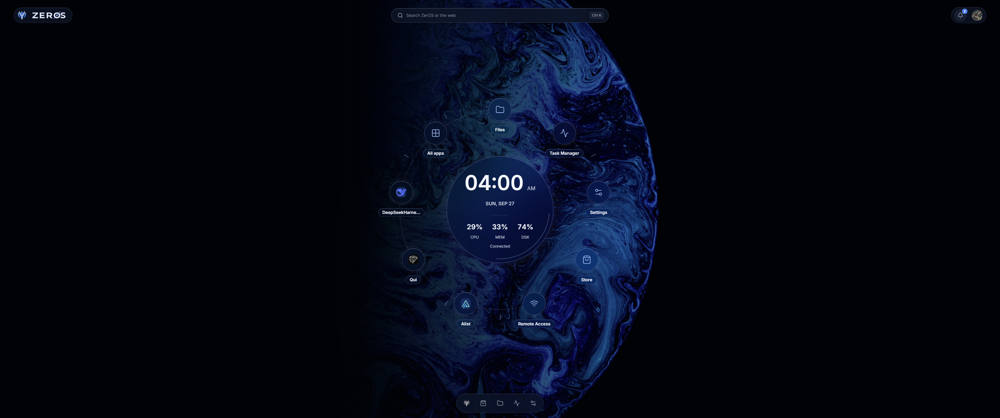
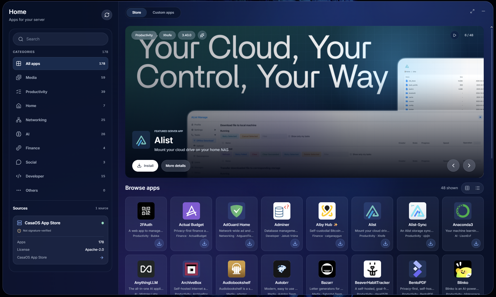
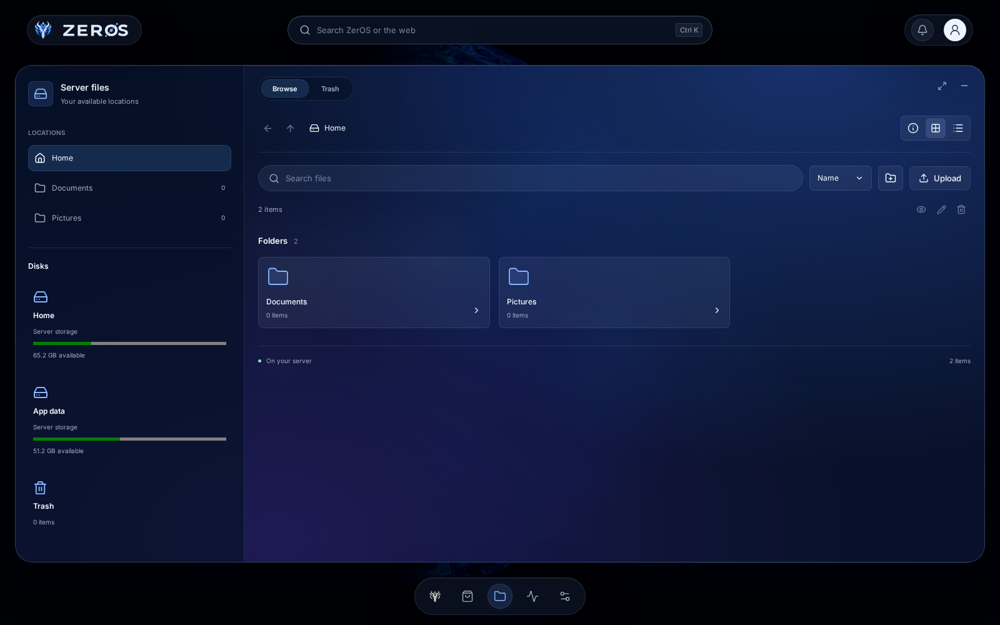
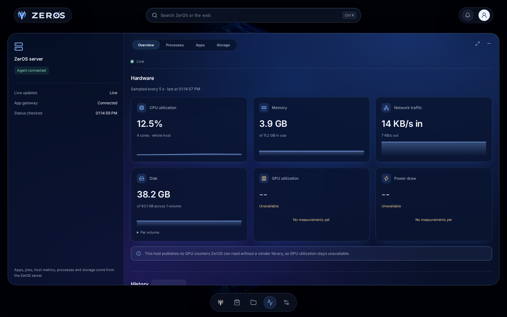
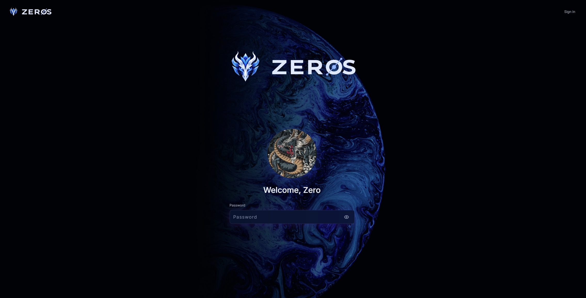

<div align="center">
  

# ZerOS

Your own personal server, with a desktop you open in any browser.

**Latest version: [see Releases](https://github.com/AmerZuher/ZerOS-releases/releases/latest)**
</div>

<p align="center">
  <a href="#install">Install</a> ·
  <a href="#what-you-get">What you get</a> ·
  <a href="#screenshots">Screenshots</a> ·
  <a href="#updates-and-backups">Updates and backups</a> ·
  <a href="#security">Security</a>
</p>

<p align="center">
  
</p>

## What is ZerOS?

ZerOS turns a Linux machine (a mini PC, a Raspberry Pi or an old computer) into a personal server.
You manage everything from one desktop in your browser: your files, the apps you install, your
server's health, storage, backups and settings, all behind one sign-in.

This repository holds the ZerOS releases: the installer, the program and ready-to-flash images.

## Install

### What you need

- Debian 12 or 13, Ubuntu 22.04 or 24.04, or Raspberry Pi OS (64-bit), on a 64-bit PC or ARM board.
- At least 1 GB of memory and 10 GB of free disk space.
- Nothing else using port 80 (ZerOS serves its desktop there).

### One command

```bash
curl -fsSL https://github.com/AmerZuher/ZerOS-releases/releases/latest/download/install.sh | sudo sh
```

The installer checks that the download is genuine before it changes anything. When it finishes, it
prints a **setup token**: open `http://<your-server>` in a browser and use the token to create your
account.

To see what it would change without changing anything:

```bash
curl -fsSL https://github.com/AmerZuher/ZerOS-releases/releases/latest/download/install.sh | sudo sh -s -- --dry-run
```

### Or flash an image

Each release also has images you write to an SD card, USB stick or disk, for the **Raspberry Pi 4
and 5** and for **x86-64 mini PCs**. See the [installation guide](docs/installation.md).

## What you get

<p align="center"></p>

- **Apps:** browse a store of self-hosted apps, see what each one will be allowed to do before you
  install it, then start, stop, update or remove it in one click.
- **Files:** upload, download, preview, organise and search your files, with a trash you can
  restore from.
- **Task Manager:** live CPU, memory, storage, network and GPU use, per-app usage and history.
- **Backups:** scheduled backups of your apps and folders, which you can check and restore.
- **Remote access:** reach your server securely from anywhere through Tailscale, without opening
  ports on your router.
- **Your desktop, your way:** ten themes, twelve desktop styles, wallpapers and pinned apps.

<p align="center"></p>

## Screenshots

| | |
| --- | --- |
|  |  |
| **Store** | **Files** |
|  |  |
| **Task Manager** | **Sign-in** |

## Updates and backups

**Updates:** Settings → Maintenance updates ZerOS, your system and your apps. Every update is
checked before it's installed, and if something goes wrong afterwards, ZerOS puts back the
previous version by itself.

**Backups:** Settings → Backups copies your app data or any folder to another drive or folder, on a
schedule, keeping as many versions as you choose.

## Security

- Your server is reached on your home network at `http://zeros.local`, and from anywhere else
  through Tailscale's encrypted connection.
- Every release is signed, and ZerOS refuses to install or update from one that isn't.
- Apps that ask for more access than usual (your hardware, your network, system folders) are
  flagged, and need your yes before they're installed.

To report a security problem, see [SECURITY.md](SECURITY.md).

## Good to know

ZerOS is young. It has been tested on Ubuntu 24.04 and Debian 12 on x86-64 machines, but not yet on
real hardware across real networks, and the Raspberry Pi image hasn't been booted yet. What changed
in each version is in the [changelog](CHANGELOG.md).

## Licence and credits

ZerOS is [MIT licensed](LICENSE.md). The photographers and projects it builds on are credited in
[CREDITS.md](CREDITS.md).

## About the creator

ZerOS is created and maintained by [Amer Zuher Alreyahi](https://github.com/AmerZuher).

<p>
  <a href="https://github.com/AmerZuher">GitHub</a> ·
  <a href="https://amer-alreyahi.vercel.app">Portfolio</a> ·
  <a href="https://www.linkedin.com/in/amer-zuher-alriyahi">LinkedIn</a>
</p>
