<div align="center">
  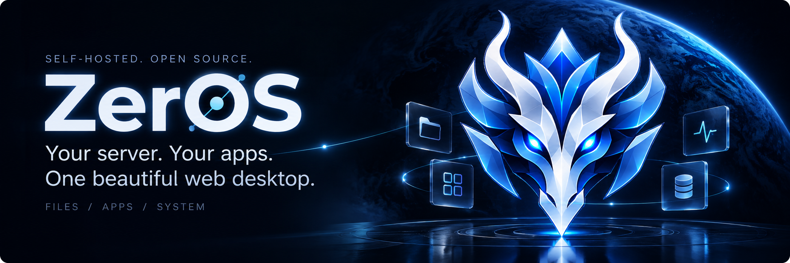

# ZerOS

Your own personal server, with a desktop you open in any browser.

**Latest version: [see Releases](https://github.com/AmerAlreyahi/ZerOS-releases/releases/latest)**
</div>

<p align="center">
  <a href="#install">Install</a> ·
  <a href="#what-you-get">What you get</a> ·
  <a href="#new-in-11">New in 1.1</a> ·
  <a href="#screenshots">Screenshots</a> ·
  <a href="#updates-and-backups">Updates and backups</a> ·
  <a href="#security">Security</a>
</p>

<p align="center">
  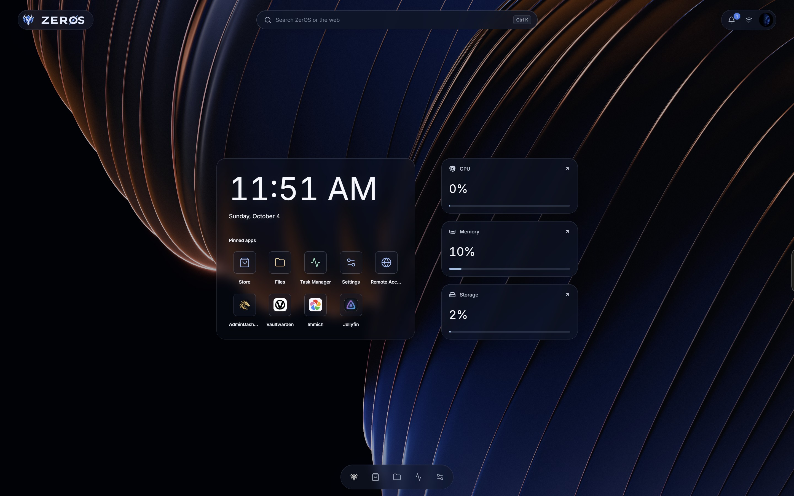
</p>

## What is ZerOS?

ZerOS turns a Linux machine (a mini PC, a Raspberry Pi or an old computer) into a personal server.
You manage everything from one desktop in your browser: your files, the apps you install, your
server's health, storage, backups and settings, all behind one sign-in.

This repository holds the ZerOS releases: the installer, the program and ready-to-flash images.

## Install

### What you need

- Debian 12 or 13, Ubuntu 22.04 or 24.04, or Raspberry Pi OS (64-bit), on a 64-bit PC or ARM board.
- At least 1 GB of memory and 10 GB of free disk space.
- Nothing else using port 80 (ZerOS serves its desktop there).

### One command

```bash
curl -fsSL https://github.com/AmerAlreyahi/ZerOS-releases/releases/latest/download/install.sh | sudo sh
```

The installer checks that the download is genuine before it changes anything. When it finishes, it
prints a **setup token**: open `http://<your-server>` in a browser and use the token to create your
account.

To see what it would change without changing anything:

```bash
curl -fsSL https://github.com/AmerAlreyahi/ZerOS-releases/releases/latest/download/install.sh | sudo sh -s -- --dry-run
```

### Or flash an image

Each release also has images you write to an SD card, USB stick or disk, for the **Raspberry Pi 4
and 5** and for **x86-64 mini PCs**. See the [installation guide](docs/installation.md).

## What you get

<p align="center">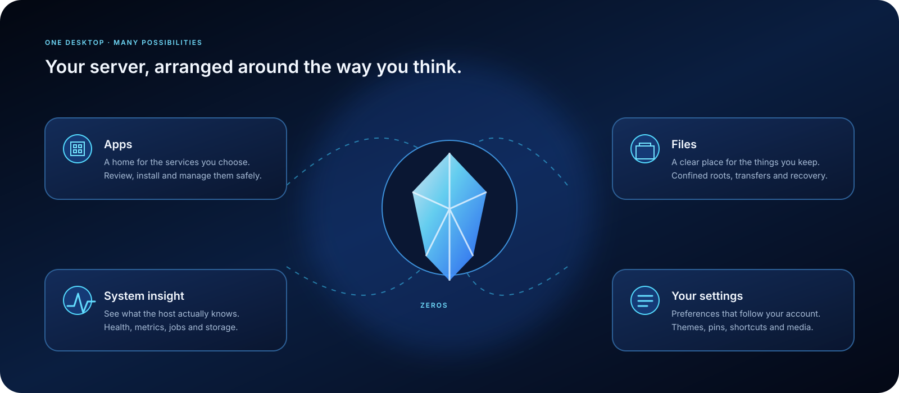</p>

- **Apps:** browse a store of self-hosted apps, see what each one will be allowed to do before you
  install it, then start, stop, update or remove it in one click.
- **Files:** upload, download, preview, organise and search your files, with a trash you can
  restore from. Photos, music, video and text open in their own windows.
- **Task Manager:** live CPU, memory, storage, network and GPU use, per-app usage and history.
- **Backups:** scheduled backups of your apps and folders, which you can check and restore.
- **Remote access:** reach your server securely from anywhere through Tailscale, without opening
  ports on your router, at a secure `https://` address your browser trusts.
- **Terminal and Wi-Fi:** a terminal on your server and Wi-Fi setup, right from the desktop.
- **Your desktop, your way:** ten themes, twelve desktop styles, wallpapers and up to twelve pinned
  apps.

<p align="center">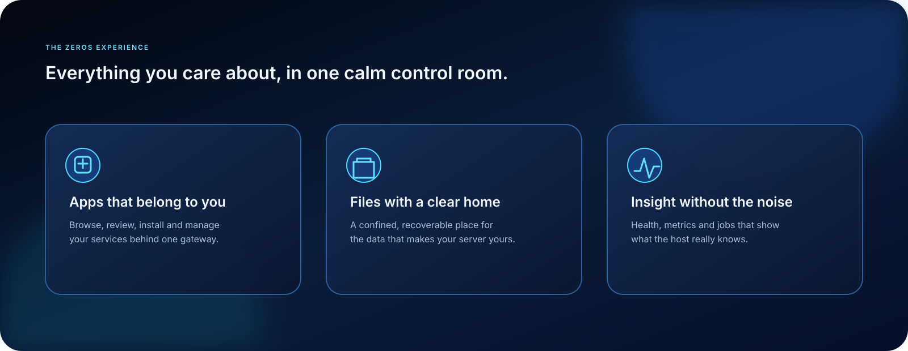</p>

## New in 1.1

<p align="center">
  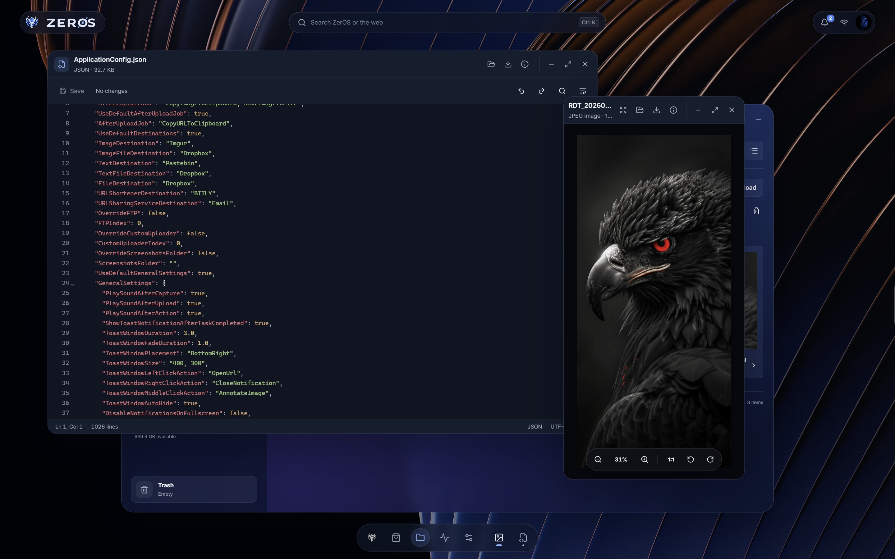
</p>

- **Real windows.** Photos, Player, Text Editor and Terminal open as windows you can move, resize,
  snap to half the screen, minimize to the dock and keep open side by side. They are kept for your
  account: a reload, or another device, brings them back.
- **Nothing you type is lost.** Text Editor keeps unsaved text on your server until you save or
  discard it, and never overwrites a file that changed meanwhile without asking.
- **Docker Hub in the Store.** Install any Docker Official Image, reviewed like every other app.
- **A secure address for the desktop.** On your tailnet, ZerOS opens at
  `https://<your-server>.<tailnet>.ts.net`, with a certificate your browser trusts.

<table>
  <tr>
    <td width="50%" align="center">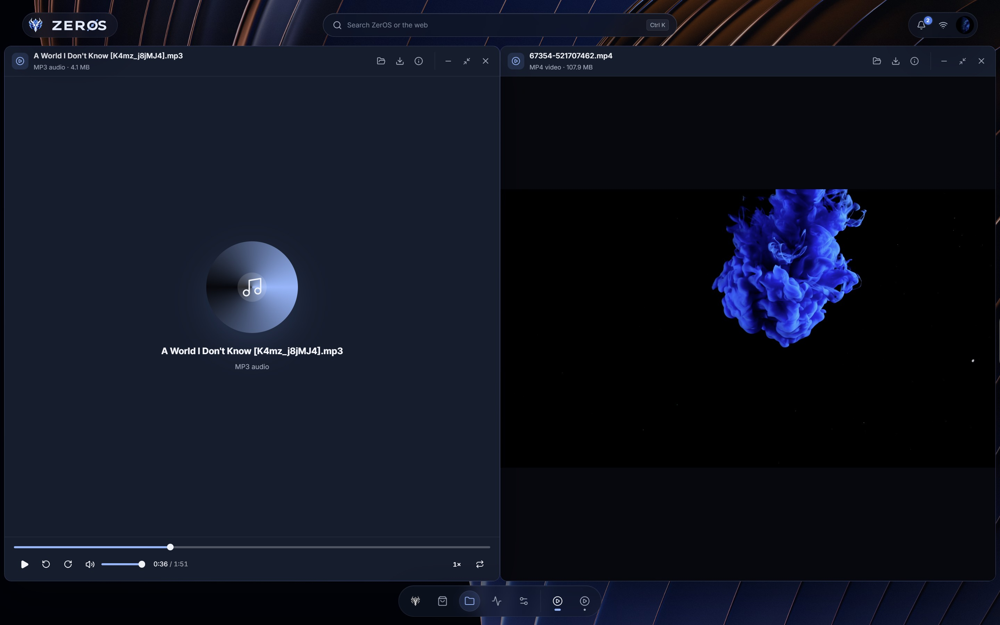<br /><b>Player windows</b></td>
    <td width="50%" align="center">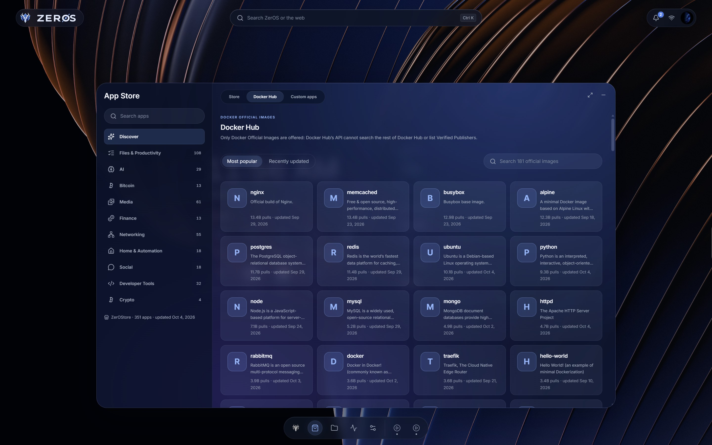<br /><b>Docker Hub</b></td>
  </tr>
  <tr>
    <td width="50%" align="center">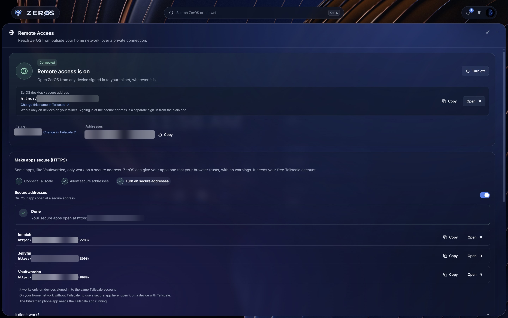<br /><b>Secure addresses</b></td>
    <td width="50%" align="center">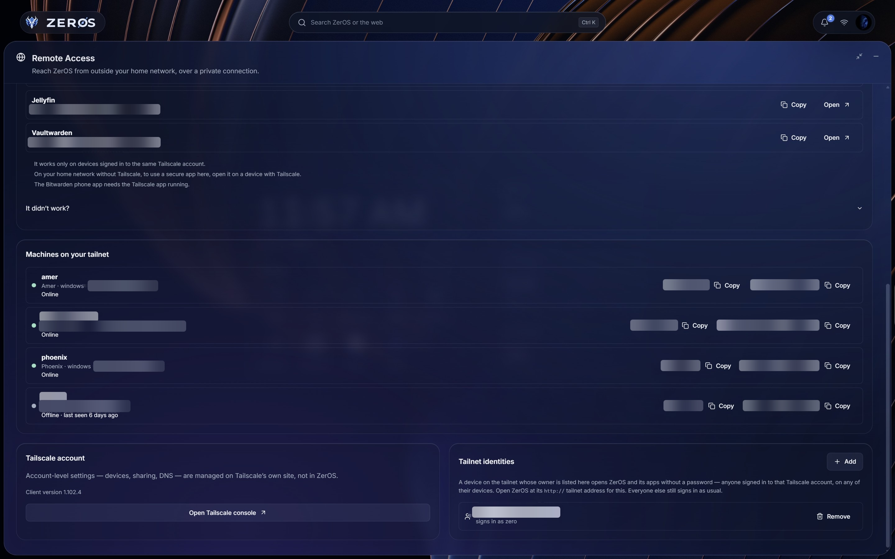<br /><b>Your tailnet</b></td>
  </tr>
</table>

## Screenshots

<table>
  <tr>
    <td width="50%" align="center">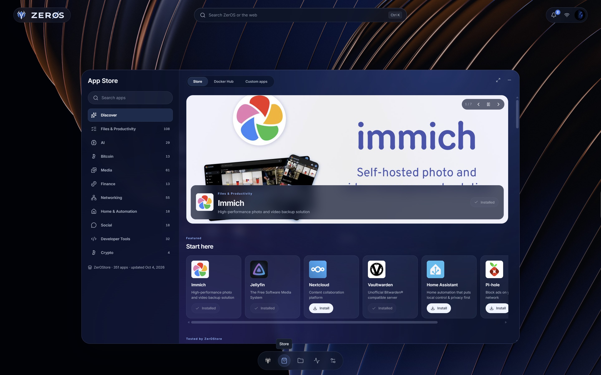<br /><b>Store</b></td>
    <td width="50%" align="center">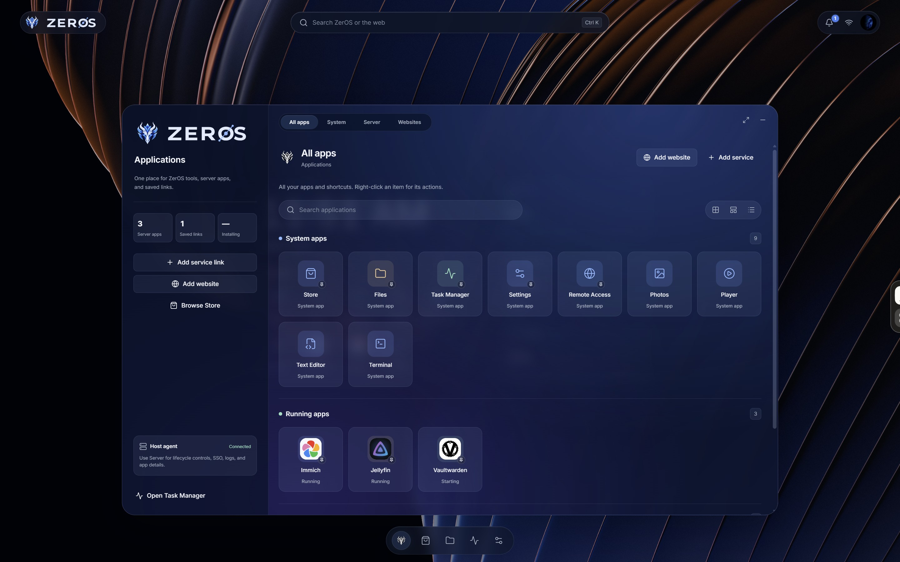<br /><b>Applications</b></td>
  </tr>
  <tr>
    <td width="50%" align="center">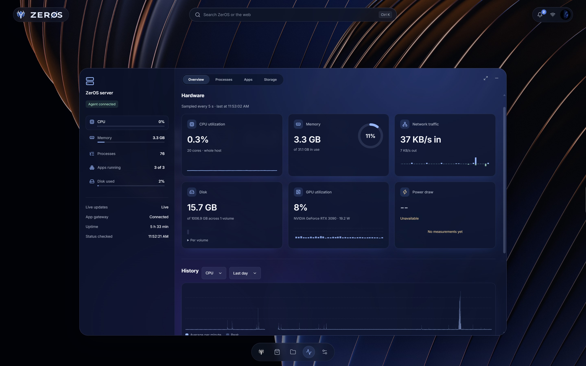<br /><b>Task Manager</b></td>
    <td width="50%" align="center">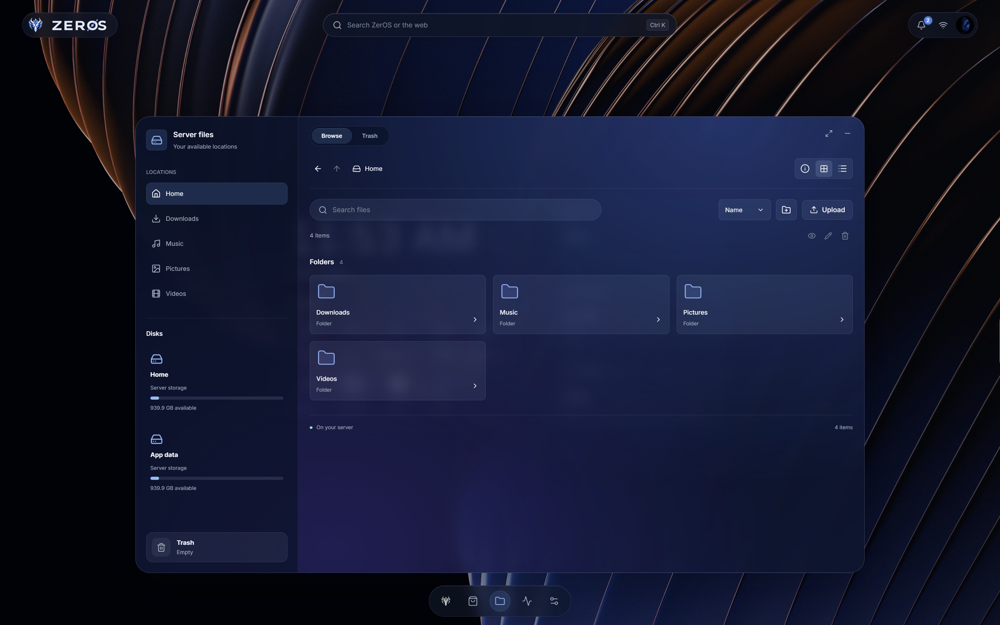<br /><b>Files</b></td>
  </tr>
  <tr>
    <td width="50%" align="center">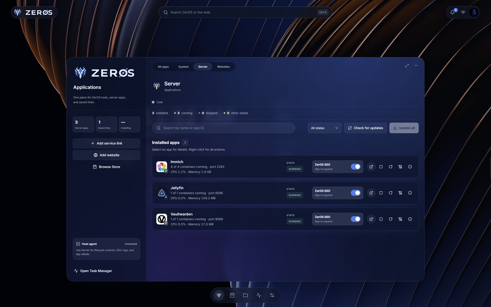<br /><b>Server apps</b></td>
    <td width="50%" align="center">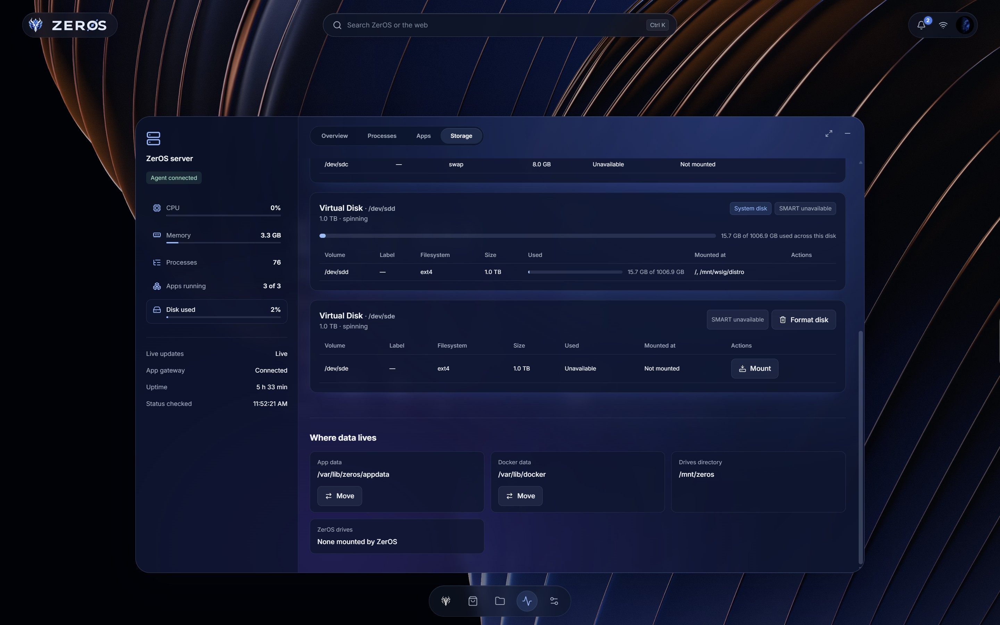<br /><b>Storage</b></td>
  </tr>
  <tr>
    <td width="50%" align="center">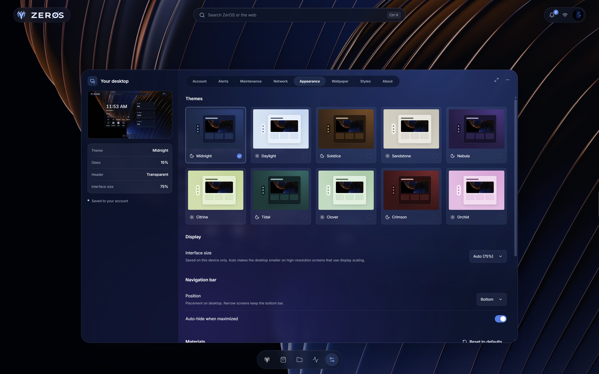<br /><b>Themes</b></td>
    <td width="50%" align="center">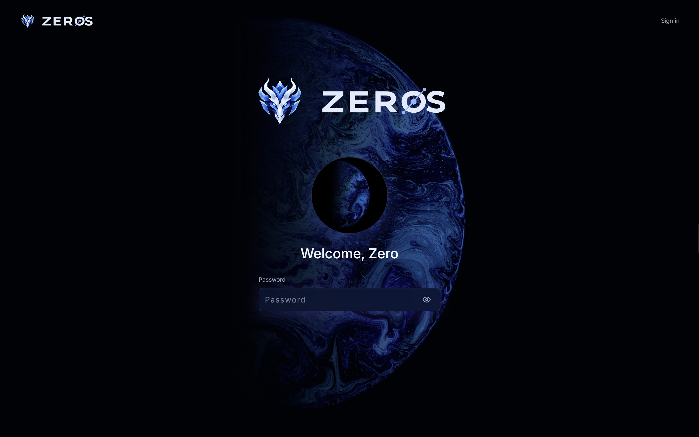<br /><b>Sign-in</b></td>
  </tr>
</table>

<p align="center">
  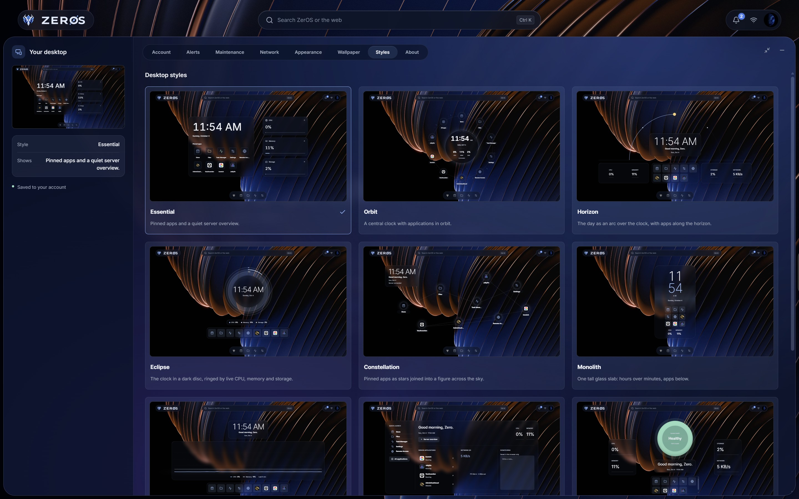
</p>

<p align="center">
  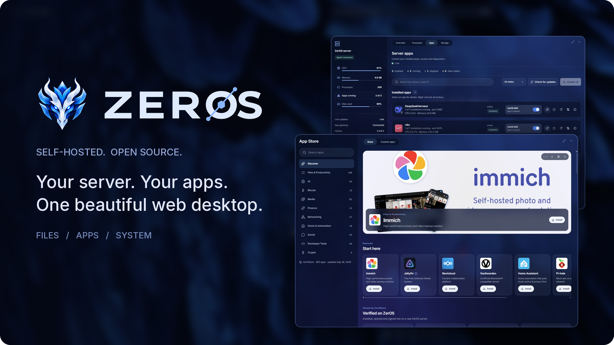
</p>

## Updates and backups

**Updates:** Settings → Maintenance updates ZerOS, your system and your apps. Every update is
checked before it's installed, and if something goes wrong afterwards, ZerOS puts back the
previous version by itself.

**Backups:** Settings → Backups copies your app data or any folder to another drive or folder, on a
schedule, keeping as many versions as you choose.

## Security

- Your server is reached on your home network at `http://zeros.local`, and from anywhere else
  through Tailscale's encrypted connection.
- Every release is signed, and ZerOS refuses to install or update from one that isn't.
- Apps that ask for more access than usual (your hardware, your network, system folders) are
  flagged, and need your yes before they're installed.

To report a security problem, see [SECURITY.md](SECURITY.md).

## Good to know

ZerOS is young. It has been tested on Ubuntu 24.04 and Debian 12 on x86-64 machines, but not yet on
real hardware across real networks, and the Raspberry Pi image hasn't been booted yet. What changed
in each version is in the [changelog](CHANGELOG.md).

## Licence and credits

ZerOS is free to install and use; its source code is not public. The terms are in
[LICENSE.md](LICENSE.md). The photographers and projects it builds on are credited in
[CREDITS.md](CREDITS.md).

## About the creator

ZerOS is created and maintained by [Amer Zuher Alreyahi](https://github.com/AmerAlreyahi).

<p>
  <a href="https://github.com/AmerAlreyahi">GitHub</a> ·
  <a href="https://amer-alreyahi.vercel.app">Portfolio</a> ·
  <a href="https://www.linkedin.com/in/amer-zuher-alriyahi">LinkedIn</a>
</p>
